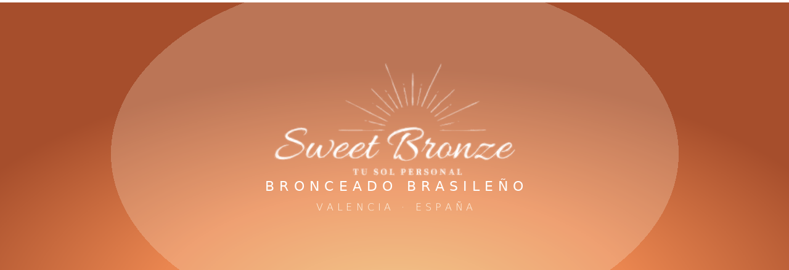
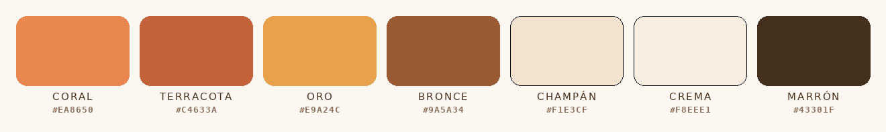

<p align="center">
  
</p>

<p align="center">
  
  
  
  
</p>

# Sweet Bronze — Sitio web

Sitio web premium para **Sweet Bronze · Bronceado Brasileño** (Valencia, España).
Construido con **Next.js 14 (App Router) + TypeScript**. Diseño cálido "hora dorada",
en español, optimizado para SEO local y para convertir visitas en reservas por WhatsApp.

> ✨ **La idea clave:** casi todo lo que vas a querer cambiar (contacto, fotos, reseñas,
> artículos) está en **3 archivos dentro de la carpeta `lib/`**. No hace falta tocar el
> resto del código.

---

## 📑 Índice

1. [Cómo arrancar el proyecto](#-1-cómo-arrancar-el-proyecto-en-tu-ordenador)
2. [Publicar online (Vercel)](#-2-publicar-el-sitio-online-vercel)
3. [Editar los datos de contacto](#-3-editar-los-datos-de-contacto-libsitets)
4. [El mapa de Google](#-4-el-mapa-de-google)
5. [Las reseñas](#-5-las-reseñas)
6. [Las fotos](#-6-las-fotos-libimagests--publicimg)
7. [Los artículos (Sweet Tips)](#-7-los-artículos-sweet-tips-libarticlests)
8. [Instagram](#-8-feed-de-instagram)
9. [Crédito Aura Digital](#-9-crédito-de-aura-digital)
10. [Colores y tipografías](#-10-colores-y-tipografías)
11. [Estructura del proyecto](#-11-estructura-del-proyecto)
12. [Problemas frecuentes](#-12-problemas-frecuentes)

---

## 🚀 1. Cómo arrancar el proyecto en tu ordenador

**Requisito:** tener **Node.js 18.18 o superior** instalado. Para comprobarlo, abre el
terminal y escribe `node -v`. Si no lo tienes, descárgalo (versión **LTS**) en
[nodejs.org](https://nodejs.org).

Dentro de la carpeta del proyecto (`sweet-bronze-next`):

```bash
npm install     # instala las dependencias (solo la primera vez)
npm run dev     # arranca el sitio en modo desarrollo
```

Abre **http://localhost:3000** en el navegador. Cada vez que guardes un cambio, la página
se actualiza sola.

> Para **parar** el servidor: `Ctrl + C` en el terminal.
> Para **editar** el código mientras corre: usa otra ventana de terminal o el editor (VS Code).

---

## ☁️ 2. Publicar el sitio online (Vercel)

La forma recomendada (gratis) y que se actualiza sola:

1. Sube el proyecto a **GitHub** (en VS Code: *Source Control → Publish to GitHub*).
2. Entra en [vercel.com](https://vercel.com) e inicia sesión **con GitHub**.
3. **Add New → Project** → elige el repositorio → **Deploy**.
4. Vercel detecta Next.js solo. No hay que configurar nada ni variables de entorno.
5. En ~2 minutos tendrás un enlace tipo `sweet-bronze-next.vercel.app`.

Cada vez que subas cambios a GitHub (*Commit → Sync*), Vercel republica automáticamente.
Si más adelante quieres un **dominio propio** (ej. `sweetbronze.es`), se conecta desde Vercel.

---

## ✏️ 3. Editar los datos de contacto (`lib/site.ts`)

Abre **`lib/site.ts`**. Cambia el texto entre comillas:

| Campo | Qué es |
|---|---|
| `whatsappNumber` | Número de WhatsApp, formato internacional **sin +, sin espacios** (ej. `34647462847`) |
| `instagram` / `instagramHandle` | Enlace y @ de Instagram |
| `hours` | Horario que se muestra |
| `address` / `addressNote` | Texto de dirección y la nota debajo |
| `priceFrom` | Precio "desde…" |
| `reviews` | Nota (`rating`) y número (`count`) de reseñas |

> El botón "Reservar" y todos los WhatsApp del sitio usan `whatsappNumber` automáticamente.

---

## 🗺️ 4. El mapa de Google

En `lib/site.ts`:

- **`mapQuery`** → lo que muestra el mapa. Ya apunta a la ficha real del negocio.
  También sirve un barrio o una calle: `"Calle Ejemplo 12, Valencia, España"`.
- **`mapEmbedUrl`** → (opcional) si quieres el mapa oficial de Google con ficha y botón de
  rutas: en Google Maps pulsa *Compartir → Insertar un mapa* y pega aquí solo el enlace de
  dentro de `src="..."`. Si lo rellenas, tiene prioridad sobre `mapQuery`.

---

## ⭐ 5. Las reseñas

Las reseñas son **reales y editables** en `lib/site.ts`:

- **`testimonials`** → lista de reseñas. Para añadir una nueva, copia un bloque y cámbialo:
  ```ts
  { text: "Texto de la reseña…", who: "Nombre A.", when: "Google · hace 1 mes" },
  ```
- **`googleReviewsUrl`** → enlace del botón "Ver más reseñas en Google".
- **`googleReviewsWidgetId`** → (opcional) si algún día usas un widget automático de
  Google Reviews (Elfsight), pega aquí su ID y sustituye al carrusel manual.

---

## 🖼️ 6. Las fotos (`lib/images.ts` + `public/img/`)

Todas las imágenes se controlan desde **un solo archivo**: `lib/images.ts`.

1. Copia tus fotos dentro de **`public/img/`**.
   - Nombres **sin espacios ni acentos** (`estudio.jpg`, no `mi foto.jpg`).
2. En `lib/images.ts`, escribe la ruta empezando por `/img/...` (**sin** la palabra `public`).
   Deja `""` para mantener el recuadro placeholder.

```ts
export const images = {
  sobre: "/img/estudio.jpg",              // vertical 4:5
  tratamientoBikini: "/img/bikini.jpg",   // 5:4
  metodo: "/img/metodo.jpg",              // cuadrada 1:1
  productos: ["/img/prod1.jpg", "", ...], // 4:3 (hasta 6)
  gallery:   ["/img/res1.jpg", "", ...],  // galería (hasta 6)
};
```

Las **portadas de artículos** están en el mismo archivo, en `articleCovers` (por slug, 16:9).
Las fotos se recortan al centro automáticamente, así que cualquier proporción funciona.

---

## 📝 7. Los artículos (Sweet Tips) (`lib/articles.ts`)

Cada artículo es un objeto del array `articles`. Para **añadir uno nuevo**, copia un bloque
y cambia:

- `slug` → define la URL (`/sweet-tips/mi-slug`)
- `title`, `category`, `excerpt`, `readingTime`, `coverLabel`
- `body` → lista de párrafos. Un bloque que empiece por `## ` se muestra como subtítulo.

La página del artículo se genera sola. (Si añades un artículo con foto de portada, recuerda
también su entrada en `articleCovers` dentro de `lib/images.ts`.)

---

## 📸 8. Feed de Instagram

En la sección "Síguenos" hay un hueco para un **widget automático** (Elfsight):

1. Crea un widget de Instagram gratuito en [Elfsight](https://elfsight.com).
2. Copia su ID (`elfsight-app-...`).
3. Pégalo en `lib/site.ts` → `instagramWidgetId`.

Mientras esté vacío, se muestra un bloque elegante con enlace directo al perfil.

---

## 💜 9. Crédito de Aura Digital

En el pie de página aparece **"Website crafted by Aura Digital"**. Al hacer clic se abre un
popup con la identidad de Aura (fondo obsidiana, aura lila, logo y botones).

Se configura en `lib/site.ts`, en `builtBy`:

```ts
builtBy: {
  url: "",                        // web de Aura (vacío = oculta el botón "Visit website")
  email: "hola@auradigital.com",  // 👈 cámbialo por el email real
  tagline: "Designing brands. Building digital presence.",
  ...
},
```

Los logos de Aura están en `public/logo/`:
`aura-digital.png` (pie, cálido) · `aura-digital-blanco.png` (popup) · `aura-digital-mark.png`.

---

## 🎨 10. Colores y tipografías

<p align="center">
  
</p>

- La paleta y los tipos están como **variables CSS** en `app/globals.css` (bloque `:root`).
- Tipografías del sitio: **Playfair Display**, **Cormorant Garamond** y **Manrope** (Google Fonts).
- Colores de marca: coral `#EA8650`, terracota `#C4633A`, oro `#E9A24C`, bronce `#9A5A34`, champán `#F1E3CF`, crema `#F8EEE1`, marrón `#43301F`.

---

## 📂 11. Estructura del proyecto

```
app/
  layout.tsx            → SEO, cabecera, pie, JSON-LD
  page.tsx              → home (todas las secciones)
  globals.css           → estilos y variables de diseño
  sweet-tips/
    page.tsx            → índice de artículos
    [slug]/page.tsx     → artículo individual
components/              → cada sección de la web
lib/
  site.ts               → contacto, reseñas, mapa, Aura  (EDITA AQUÍ)
  images.ts             → todas las fotos                (EDITA AQUÍ)
  articles.ts           → contenido de Sweet Tips        (EDITA AQUÍ)
public/
  img/                  → tus fotos
  logo/                 → logos (Sweet Bronze y Aura)
```

---

## 🛠️ 12. Problemas frecuentes

- **Cambié un archivo y no se ve / da error raro / un artículo da 404:**
  para el servidor (`Ctrl + C`), borra la carpeta de caché `.next` y arranca de nuevo:
  - Windows: `rmdir /s /q .next` y luego `npm run dev`
  - Mac/Linux/Git Bash: `rm -rf .next && npm run dev`
  Refresca con `Ctrl + Shift + R`.

- **Una foto no aparece:** revisa que el nombre del archivo coincida **exactamente**
  (mayúsculas incluidas) con lo escrito en `lib/images.ts`, y que empiece por `/img/`.

- **El feed de Instagram / reseñas no carga:** solo aparece en un navegador real
  (`npm run dev` o ya publicado), no siempre en vistas previas.

---

<p align="center">
  <br/>
  
</p>

<p align="center">
  <b>Website crafted by Aura Digital</b><br/>
  <sub><i>Creative Studio · Brand, Web &amp; Digital Design · Valencia, Spain</i></sub>
</p>

<p align="center">
  <a href="https://auradigital.com"></a>
  <a href="mailto:hola@auradigital.com"></a>
  <a href="https://instagram.com/auradigital"></a>
</p>

<p align="center">
  <sub>Cambia los enlaces de arriba (web, email, Instagram) por los reales de Aura Digital.</sub>
</p>

<p align="center">
  <sub>© 2026 Sweet Bronze · Bronceado Brasileño · Valencia, España</sub>
</p>